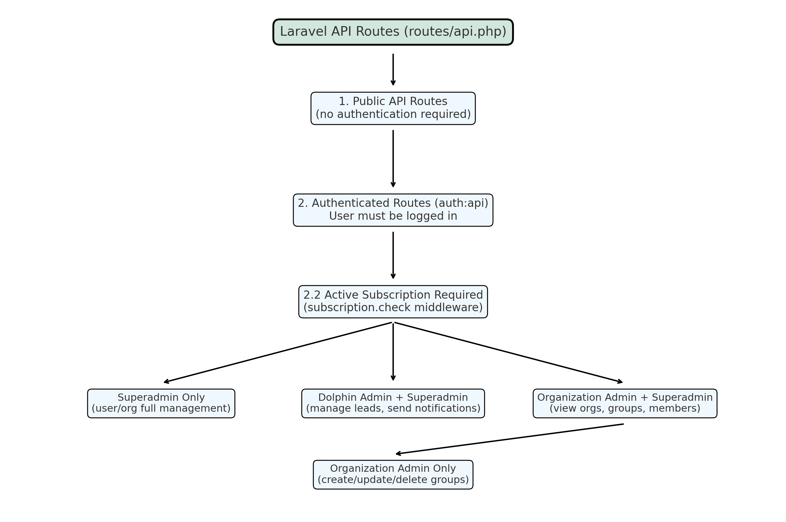
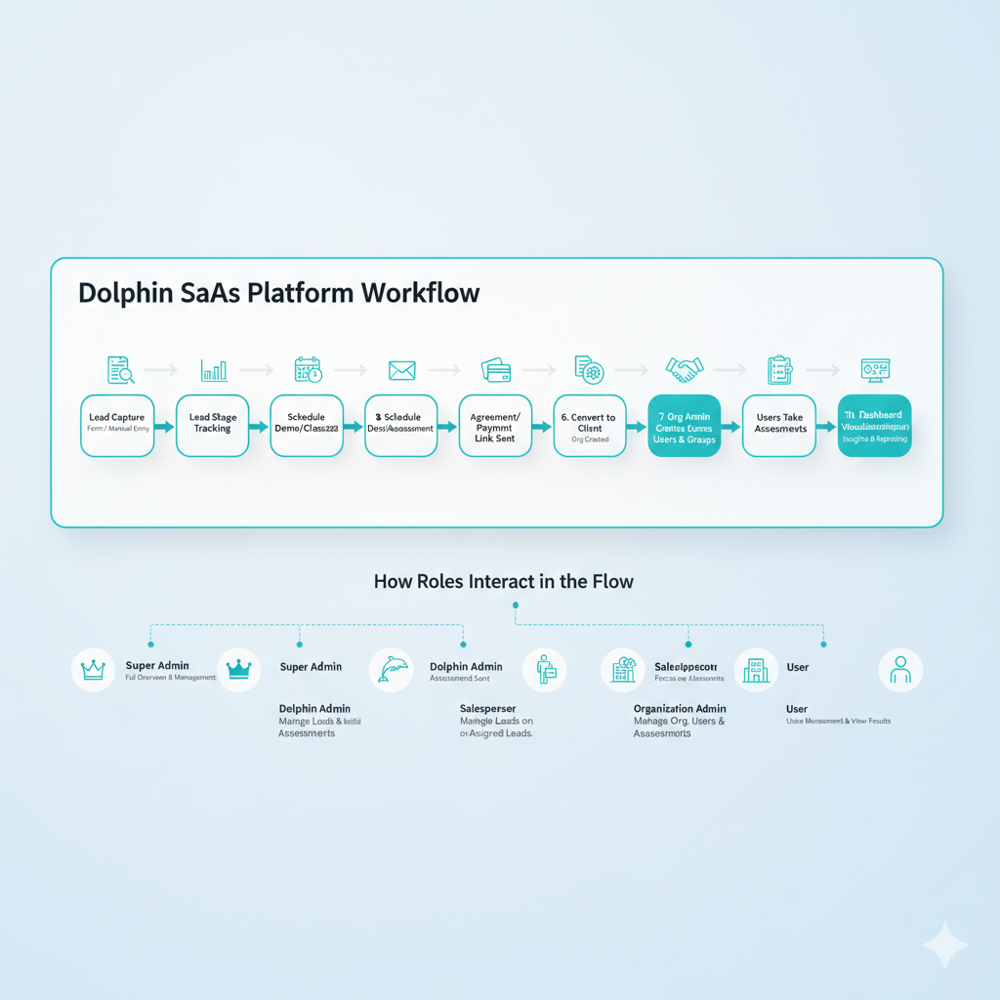
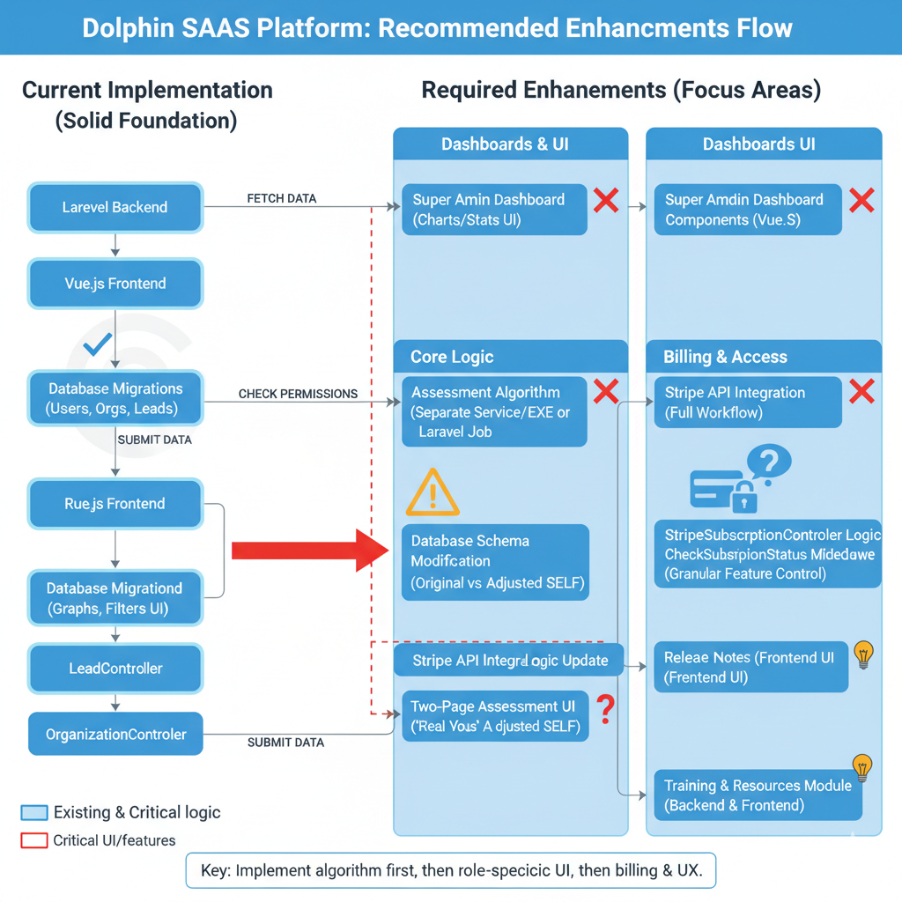

# Dolphin Full Stack Project

Dolphin is a comprehensive web application designed for assessment and lead management. It features a decoupled architecture with a Laravel-powered backend and a Vue.js single-page application (SPA) frontend.

## Project Structure

The repository is organized as a monorepo containing the two main parts of the application:

-   `Dolphin_Backend/`: The Laravel backend API. It handles business logic, data storage, and authentication.
-   `Dolphin_Frontend/`: The Vue.js frontend. It provides the user interface and consumes the backend API.

## Tech Stack

-   **Backend**: PHP, Laravel
-   **Frontend**: JavaScript, Vue.js
-   **Database**: MySQL (or other Laravel-supported database)
-   **API**: RESTful API with Laravel Passport for authentication.

## Prerequisites

Before you begin, ensure you have the following installed on your local machine:

-   PHP (>= 8.1)
-   Composer
-   Node.js & npm
-   A database server (e.g., MySQL)

## Getting Started

### 1. Clone the Repository

```bash
git clone <repository-url>
cd Dolphin
```

### 2. Backend Setup

Navigate to the backend directory and set up the Laravel application.

```bash
cd Dolphin_Backend

# Install PHP dependencies
composer install

# Create a copy of the .env.example file
cp .env.example .env

# Generate an application key
php artisan key:generate

# Configure your database credentials in the .env file
# DB_CONNECTION=mysql
# DB_HOST=127.0.0.1
# DB_PORT=3306
# DB_DATABASE=dolphin
# DB_USERNAME=root
# DB_PASSWORD=

# Run database migrations
# Note: As of January 2025, migrations have been consolidated into a single baseline.
# See Dolphin_Backend/MIGRATION_GUIDE.md for details on existing databases.
php artisan migrate

# Set up Laravel Passport for API authentication
php artisan passport:install
```

### 3. Frontend Setup

Navigate to the frontend directory and set up the Vue.js application.

```bash
cd ../Dolphin_Frontend

# Install JavaScript dependencies
npm install

# Create a .env file for environment variables
# You may need to create a .env.local file and add the following:
VUE_APP_API_BASE_URL=http://127.0.0.1:8000
```

### 4. Running the Application

A convenience script `start-dev.sh` is provided to start both the backend and frontend development servers concurrently.

From the root directory of the project:

```bash
./start-dev.sh
```


## Key Features

-   User Registration and Authentication
-   Organization and Group Management
-   Lead Management and Prefill Forms
-   Customizable Assessments
-   Notification System (Scheduled and Immediate)
-   Role-based Permissions
-   Stripe Integration for Payments




